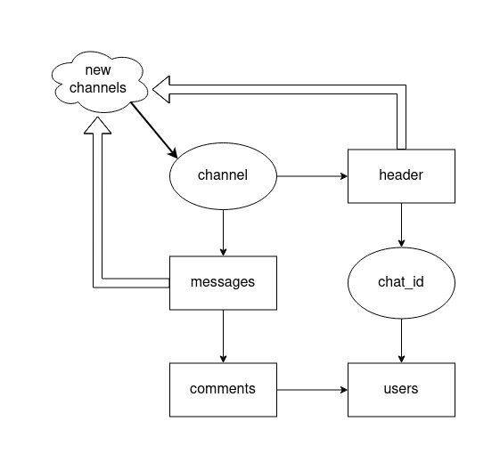
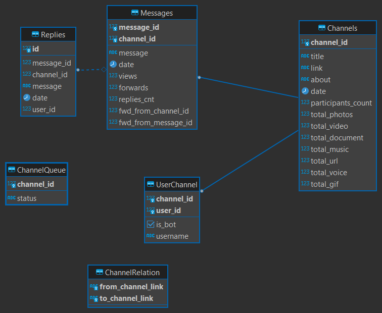

## Telegram-client

Code to crawl on telegram and collect channels information including:
- description  
- messages
- participants (commenters and chat users)

## Data flows

## Database structure:

